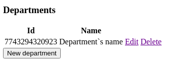
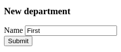
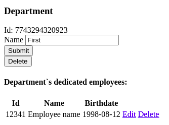
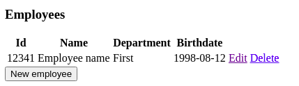
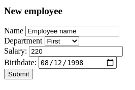
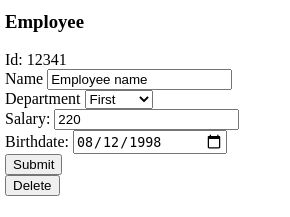

# Department app

This is a simple multi-module maven app for managing people at some company or organisation.  

A database stores information about employees and departments they belong to. This information is only used for people who working with this app to manage employee.  
Users of the system should be able to retrieve information about departments and employees that belong to any department. No profiles/authority needed because of locality of the system. User should be able to do:

* Employee:
  * Create new
  * View and edit exact one
  * View list of all entities
  * Delete

* Department:
  * Create new
  * View and edit exact one
  * View list of all entities
  * View related employees
  * Delete

## Application use-cases

### Department

#### View all

View all departments, see all included info - `name` and `id`  

#### Add new

Add new department scenario:
* Button "_New department_" in department list used
* All needed info inserted
  * if not valid - stay
  * if valid - proceed
* Form proceeded - db query execute
* Department list opened  

#### Edit existing

Edit existing department scenario:
* Button "_Edit_" in list near any department used
* All needed info inserted
  * if not valid - stay
  * if valid - proceed
* Form proceeded - db query execute
* Department list opened

  

This page also shows all related employees.  

#### Delete existing

Delete existing department scenario:
* Button "_Delete_" in list near any department in department page used
* Db insertion attempt
* Department list opened

### Employee

#### View all

View all employees, see all included info - `id`, `name`, `date_of_birth`, `salary` and related `department_id`.  

#### Add new

Add new employee scenario:
* Button "_New employee_" in employee list used
* All needed info inserted
  * if not valid - stay
  * if valid - proceed
* Form proceeded - db query execute
* Employee list opened

#### Edit existing

Edit existing employee scenario:
* Button "_Edit_" in list near any employee used
* All needed info inserted
  * if not valid - stay
  * if valid - proceed
* Form proceeded - db query execute
* Employee list opened

#### Delete existing

Delete existing employee scenario:
* Button "_Delete_" in list near any employee in employee page used
* Db query execute
* Employee list opened

### References

[Static html prototypes](html_prototype)

[Data model description](Data%20model%20decription.md)