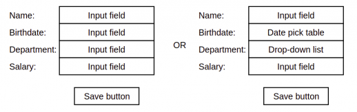

# Department app

This is a simple multi-module maven app for managing people at some company or organisation.

### Description

#### Model

Database stores:
* Information about `employee` - name, birthdate, salary, related department;
* Information about `department` - name.  

ER model:  


#### User interface

App contains a view model to provide all information and edit possibilities to user. User able to:  
* `employee` - CRUD operations and view exact one;
* `department` - CRUD operations.

Mock employee page (edit form):  



[Static html prototypes](html_prototype)

### Environment

Requirements:
* **h2 embedded database** (no need to install) and/or **postgres db**
* OS-independent launch - only **java** required
* **Maven 3.6.3** and **jdk 11** to build (install)

### Instruction

Follow steps below to run it (machine need to stick to requirements above).

#### Build app

```shell
 mvn clean install -DskipTests
```

#### Run app

Application uses Spring Boot embedded Tomcat server, so it can be launched without installing any 
new packages, maven will do it by itself.

```shell
java -jar ./web-app/target/web-app-1.0.jar
```

Notes:
* app launches only from web module only on this and some other stage.
* use `^C` to stop app (`ctrl + C` or `cmd + C`).
* project was developed and build on Ubuntu OS.

#### Use

Application available at `localhost:8080`, h2 database at `localhost:8080/h2-console`


